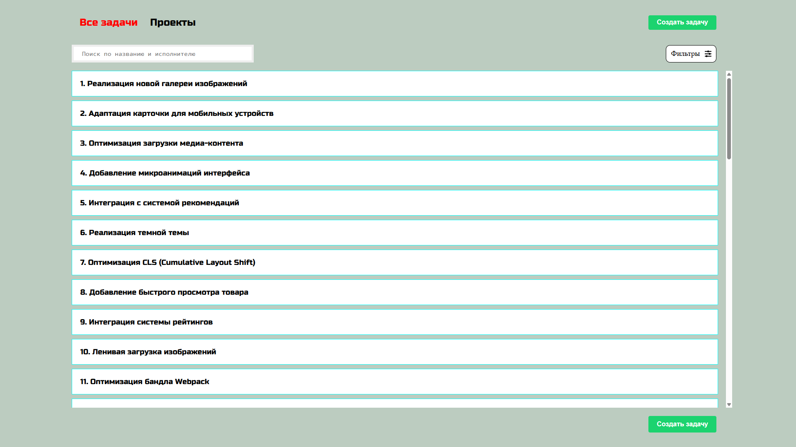

# Тестовое задание для стажёра Frontend-направления (весенняя волна 2025) в Авито

---

# Система управления проектами

## Необходимые требования

- Установленный Docker и Docker Compose

## Установка

1. Клонировать репозиторий

```bash
git clone https://github.com/FireSpirit171/project-management-system
```

2. Перейти в папку проекта и запустить docker-compose

```bash
cd project-management-system
docker compose up --build
```

3. Приложение доступно на `http://localhost:5173`, бэкенд запущен на `http://localhost:8080`

## Необязательные технологии

В дополнение к обязательным инструментам я использовал ряд дополнительных технологий, которые упростили реализацию функциональности и ускорили процесс разработки.

### TypeScript

Я использовал `TypeScript` для типизации всех компонентов и функций. Это позволило писать более предсказуемый и безопасный код, особенно при работе с API. Типы данных `Task`, `Board` используются по всему приложению, а типизация добавлена практически везде (надеюсь), без использования `any`.

### Redux Toolkit

Для хранения глобального состояния я выбрал `Redux Toolkit`. Он пригодился для управлением состояния модального окна Modal. Поскольку в него вкладываются написанные формы `CreateTaskForm.tsx` и `EditFormTask.tsx`, а также фильтр `Filter.tsx`, то централизованное управление отображением и скрытием окна очень удобно. В будущем, при необходимости, state-менеджер можно использовать для авторизации.

### Vite

Я выбрал `Vite` для быстрой разработки в сжатые сроки, а также для простой сборки проекта без необходимости настраивания Webpack. Благодаря Vite проект запускается мгновенно, и любые изменения сразу видны в браузере, что особенно удобно при активной верстке и отладке компонентов.

### Axios

Я использовал `Axios` для обращения к backend API. Он работает асинхроно, прост в использовании и сразу парсит данные в json формат.

### Prettier (расширение VS Code)

Для автоматического форматирования кода я использовал расширение `Prettier` в VS Code. Просто потому, что это красиво.

### @hello-pangea/dnd

Для реализации drag-and-drop я использовал форк библиотеки `react-beautiful-dnd` — `@hello-pangea/dnd`, потому что `react-beautiful-dnd` пока не поддерживает React 19. Библиотека используется на странице `BoardPage.tsx` для перетаскивания задач между колонками, с автоматическим обновлением порядка и статуса задач.

## Описание

#### Страница всех досок

На странице отображены все доски и процент выполнения задач на ней. По нажатию на доску, произойдет переход на неё.


#### Доска

Страница одной доски, на которой отображены все задачи в различных статусах. При редактировании задачи достаточно нажать на неё и откроется окно модальное окно с возможностью отредактировать задачу. Также смену статуса можно произвести путём перетаскивания задачи из одной колонки в другую


#### Создание задачи

При нажатии на кнопку `Создать задачу` (в хэдере или в списке всех задач) открывается модальное окно для ввода данных. Необходимо ввести название и описание задачи, выбрать проект (доску), к которому задача будет прикреплена, установить приоритет и исполнителя.


#### Редактирование задачи

При нажатии на карточку задачи (на доске или в списке всех задач) открывается модальное окно для редактирования данных. Можно изменить название и описание, установить новые приоритет, статус и исполнителя. Если модальное окно открыто на странице всех задач, есть кнопка для перехода на доску.


#### Список задачи

Список всех задач. При нажатии на задачу откроется модальное окно редактирования с возможностью перехода на саму доску. Есть поисковое поле для фильтрации по названию задачи и имени исполнителя. При нажатии на кнопку `Фильтры` откроется модальное окно с фильтром по статусу и доске. Применить поиск можно по нажатию кнопки `Применить` и сбросить фильтры по кнопке `Сбросить`.


